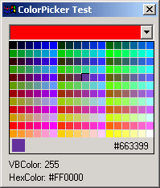



## WebSafe ColorPicker

### Description

Selects a color
 
### More Info
 
ColorCodes in HEX (Web) and VBColor codes

It formats your harddrive and steals your girlfriend :)

             |
---                |---
**Submitted On**   |2002-05-07 23:09:24
**By**             |[Dondata](https://github.com/Planet-Source-Code/PSCIndex/blob/master/ByAuthor/dondata.md)
**Level**          |Intermediate
**User Rating**    |4.0 (16 globes from 4 users)
**Compatibility**  |VB 5\.0, VB 6\.0
**Category**       |[Custom Controls/ Forms/  Menus](https://github.com/Planet-Source-Code/PSCIndex/blob/master/ByCategory/custom-controls-forms-menus__1-4.md)
**World**          |[Visual Basic](https://github.com/Planet-Source-Code/PSCIndex/blob/master/ByWorld/visual-basic.md)
**Archive File**   |[WebSafe\_Co80502572002\.zip](https://github.com/Planet-Source-Code/dondata-websafe-colorpicker__1-34539/archive/master.zip)

